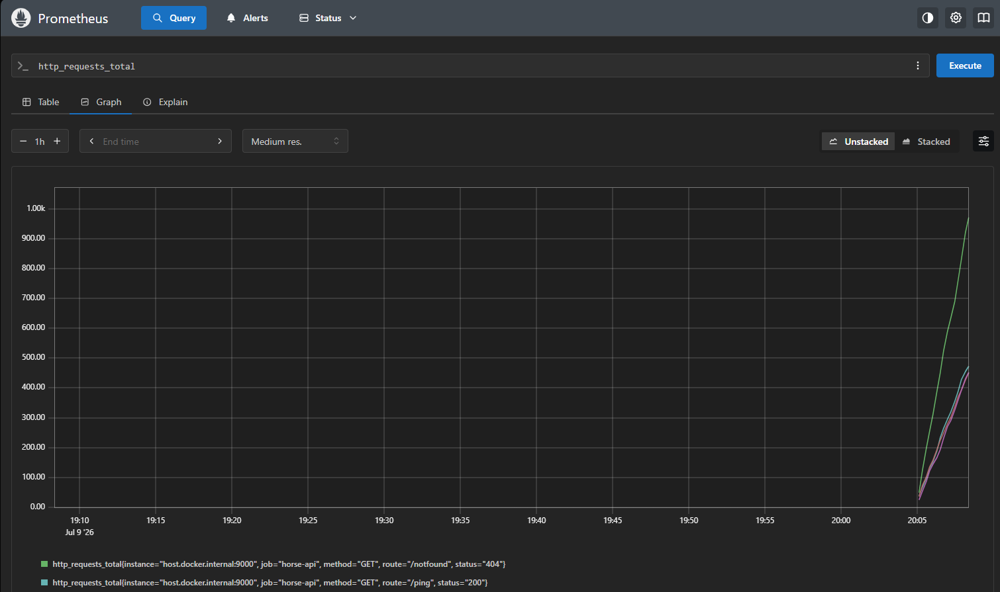
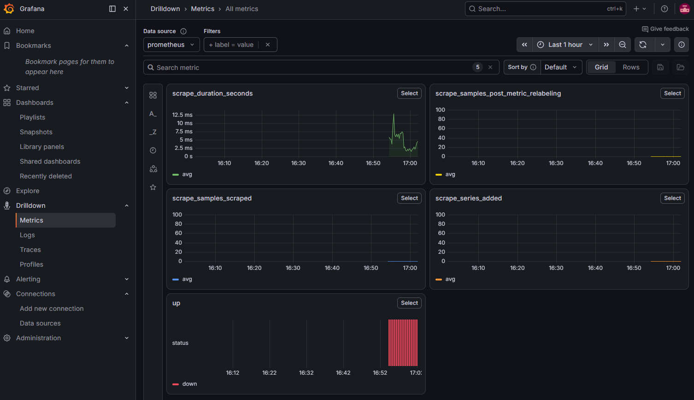

# horse-prometheus

Middleware de **Prometheus** para o framework web **Horse**.

Este middleware coleta e expõe métricas de performance e tráfego de forma automática no padrão do Prometheus, facilitando o monitoramento de APIs Delphi e Lazarus (FPC).

---

## 📈 O que são Prometheus e Grafana?

Para compreender como este middleware ajuda a monitorar sua aplicação, é importante conhecer o papel de cada uma das ferramentas:

* **Prometheus**: É uma ferramenta de monitoramento e banco de dados de séries temporais (TSDB) de código aberto. Ele funciona no modelo de coleta ativa por *scraping* (pull), ou seja, ele busca periodicamente os dados de métricas expostos pelo middleware em um endpoint de texto puro (padrão `/metrics`) na sua API e os armazena para análise.
* **Grafana**: É a plataforma de visualização líder no mercado. Ele se conecta ao Prometheus para consumir esses dados temporais brutos e os converte em painéis gráficos (dashboards) inteligentes e dashboards dinâmicos, facilitando o monitoramento de tráfego, latência e erros em tempo real.

---

## 💡 Quando usar?

Você deve utilizar este middleware quando precisar de:
1. **Monitoramento de Volume (Tráfego)**: Acompanhar o número total de requisições HTTP recebidas por método, rota e código de status.
2. **Análise de Latência**: Medir o tempo de processamento de cada rota para identificar lentidões e gargalos de performance.
3. **Métricas de Concorrência**: Monitorar a quantidade de requisições que estão sendo processadas simultaneamente no servidor.
4. **Dashboards de Observabilidade**: Integrar suas APIs Delphi/Lazarus com coletores Prometheus e gerar painéis gráficos no Grafana.

---

## ⚙️ Como funciona?

O middleware intercepta as requisições HTTP e serve o endpoint de métricas de forma transparente:
1. **Interceptação de Métricas**: Quando uma requisição atinge o caminho configurado (padrão: `/metrics`), o middleware responde imediatamente com os dados coletados no formato de texto puro aceito pelo Prometheus, sem repassar a requisição adiante.
2. **Medição de Tempo (Latência)**: Utiliza `TStopwatch` (no Delphi) ou `TThread.GetTickCount64` (no Lazarus) para garantir medições de tempo precisas do ciclo de vida das rotas de negócio.
3. **Contagem e Registro Thread-Safe**: Utiliza seções críticas (`TCriticalSection`) para garantir que os dicionários de contadores globais sejam atualizados com segurança em ambientes multithread.
4. **Métricas Expostas**:
   - `http_requests_total`: Contador incremental por método, rota e status (ex: `GET /users 200`).
   - `http_request_duration_seconds`: Mapeamento de latência média (`sum` e `count`) por método e rota.
   - `http_active_requests`: Quantidade de requisições ativas sendo processadas no exato momento.

---

## 🚀 Instalação

### Via Boss Package Manager
A forma recomendada de instalação é através do gerenciador de pacotes [Boss](https://github.com/HashLoad/boss) (ou usando a ferramenta do seu ambiente, como `boss4d`):
```sh
boss install horse-prometheus
```

### Instalação Manual
Caso prefira, basta clonar este repositório e adicionar o caminho da pasta raiz do projeto no **Search Path** da sua IDE (Delphi ou Lazarus).

---

## 💻 Compatibilidade

Este middleware é 100% compatível com:
* **Delphi XE3 ou superior** (Win32, Win64, Linux, etc.)
* **Lazarus / FPC** (modo de sintaxe Delphi)

---

## ⚡ Exemplo Prático de Uso

### Delphi (Usando métodos anônimos)
```delphi
uses
  System.SysUtils,
  Horse,
  Horse.Prometheus;

begin
  // Registrar o middleware do Prometheus
  THorse.Use(THorsePrometheus.Middleware);

  THorse.Get('/ping',
    procedure(Req: THorseRequest; Res: THorseResponse)
    begin
      Res.Send('pong');
    end);

  THorse.Listen(9000);
end.
```

### Lazarus / FPC (Usando procedimentos convencionais)
```delphi
program Server;

{$MODE DELPHI}{$H+}

uses
  SysUtils, Horse, Horse.Prometheus;

procedure GetPing(Req: THorseRequest; Res: THorseResponse; Next: TNextProc);
begin
  Res.Send('pong');
end;

begin
  THorse.Use(THorsePrometheus.Middleware);
  
  THorse.Get('/ping', GetPing);
  
  THorse.Listen(9000);
end.
```

---

## 🔧 Configuração Personalizada

Por padrão, as métricas são publicadas no path `/metrics`. É possível personalizar este caminho utilizando o método:

```delphi
THorsePrometheus.SetMetricsPath('meu-path-customizado');
```

---

## 🐳 Como Configurar o Prometheus e Grafana Local

O projeto já inclui um arquivo de configuração Docker pronto para levantar o ecossistema de observabilidade localmente na pasta [docker/](file:///d:/Delphi/horse-prometheus/docker/).

1. Abra o terminal e navegue até a pasta `docker/` do projeto.
2. Execute o comando:
   ```bash
   docker compose up -d
   ```
3. O painel do **Prometheus** estará disponível em: 👉 **[http://localhost:9090](http://localhost:9090)**
4. O painel do **Grafana** estará disponível em: 👉 **[http://localhost:3000](http://localhost:3000)** (Usuário: `admin` | Senha: `admin`)


---

## 📊 Visualização no Prometheus e Grafana

Abaixo estão explicadas as duas principais telas de observabilidade disponíveis após rodar os testes e popular a stack local:

### 1. Painel de Consulta do Prometheus (Expression Browser)
Permite executar queries PromQL diretamente no banco de dados e obter visualizações rápidas de gráficos brutos para validar se as métricas da sua API Horse estão sendo recebidas corretamente.



---

### 2. Dashboard do Grafana
Se conecta ao Prometheus para construir dashboards modernos, dinâmicos e completos. Com as métricas geradas por este middleware, você pode criar belíssimos gráficos de chamadas HTTP por segundo, distribuição de status code e latência.



---

## 🧪 Como Executar os Testes

O projeto conta com testes unitários e de integração automatizados para garantir a estabilidade do middleware:

### 1. Testes Unitários
Para validar o comportamento interno da formatação das métricas, limpeza do path e incremento de contadores:
1. Abra o PowerShell e navegue até a pasta `tests/`.
2. Execute o script de testes:
   ```powershell
   cd tests
   .\run_tests.ps1
   ```
   *O script irá compilar e validar os resultados automaticamente no Delphi (via DCC32) e no Lazarus (via FPC).*

### 2. Testes de Integração (Ponta a Ponta / E2E)
Para provar o comportamento real do servidor web respondendo requisições HTTP e registrando as métricas do Prometheus:
1. Abra o PowerShell e navegue até a pasta `tests/`.
2. Execute o script de integração:
   ```powershell
   cd tests
   .\test_integration.ps1
   ```
   *O script irá compilar o exemplo, iniciar o servidor localmente em segundo plano, disparar requisições simuladas via HTTP, ler o endpoint `/metrics` e validar se os valores dos contadores e latências de resposta correspondem exatamente ao tráfego gerado.*

---

## 📄 Licença

Este projeto está licenciado sob a [Apache License 2.0](LICENSE).
